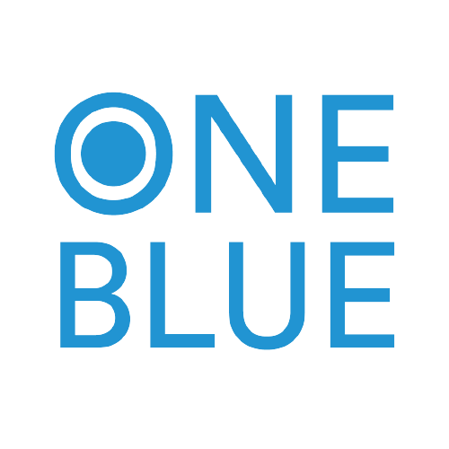
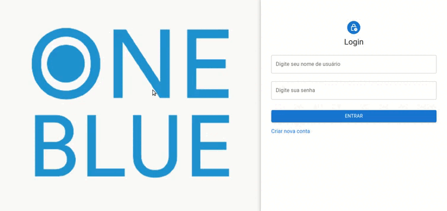

<p align="center">
   
</p>

<p align="center">
   
    
    
</p>

### Sobre o projeto

O projeto desenvolvido e integrado através da API encaminhada ([Api](https://github.com/oneblueapp/testing_react_js)).

O layout foi dividido em três páginas: Login | Cadastro de Usuário | Acesso usuário falso (por não ter middleware dentro da aplicação).

Ele contém validação de campos, comparação de senhas e integração do método POST (Login e Cadastro de usuário).

### Pergunta | Questões

O candidato(a) deverá criar uma aplicação em ReactJS> com temática de layout de sua escolha e integrar com a aplicação backend presente neste repositório o objetivo desta aplicação é uma interação visual com a API de cadastro de usuário e login do mesmo. Com trativas de erros e validações Utilizar: - ReactJS - Yup - Styled-components(opcional) - Material-UI(opcional)

### Funcionalidades

- [x] Reactjs
- [x] Yup
- [x] Styled-Components (Opcional)
- [x] Material-UI (Opcional)

### Layout

O layout da aplicação da aplicação está disponível abaixo:

<div>
    <table>
      <thead>
        <tr>
           <th>
              
           </th>
        </tr>
      </thead>
      <tbody>
      </tbody>
    </table>
</div>

### 🚀 Como executar o projeto

Este projeto é dividido em três partes:

<ul>
   <li>Construção de Componentes</li>
   <li>Aplicabilidade de Validações c/ Yup</li>
   <li>Conexão entre backend e frontend (login | cadastro de usuário)</li>
</ul>

💡 Aplicação incorporada dentro do React.

#### Pré-requisitos

Antes de começar, você vai precisar ter instalado em sua máquina as seguintes ferramentas: [Git](https://git-scm.com/), [Node.js](https://nodejs.org/en/). Alem disto é bom ter um editor para trabalhar com o código como [VSCode](https://code.visualstudio.com/).

##### 🧭 Rodando a aplicação web - React

```bash

# Clone este repositório
$ git clone https://github.com/MateusMaciel340/reactjs-one-blue.git
# Acesse a pasta do projeto no terminal/cmd - React
$ cd reactjs-one-blue/

# Instale as dependências
$ npm install

# Execute a aplicação em modo de desenvolvimento
$ npm start

# Lembre-se de iniciar a API antes!

# O servidor inciará na porta:3000 - acesse http://localhost:3000

```

### 🛠 Tecnologias

As seguintes ferramentas foram usadas na construção do projeto:

<b>Front-end ([React](https://reactjs.org/))</b>

<ul>
   <li>React - Biblioteca JavaScript</li>
   <li>Yup - Validação no Reactjs</li>
   <li>React-Router-Dom - Rotas de aplicações Reactjs</li>
   <li>Styled-Components - Estilização CSS com JavaScript</li>
   <li>Material UI - Componentes React UI</li>
</ul>


### 👨‍ Contribuidores

<div>
    <table>
      <thead>
        <tr>
           <th>
              
           </th>
        </tr>
      </thead>
      <tbody  align="center">
           <td>
             Mateus Maciel
           </td>
      </tbody>
    </table>
</div>

### 📝 Licença

Este projeto esta sobe a licença [MIT](https://github.com/git/git-scm.com/blob/main/MIT-LICENSE.txt).